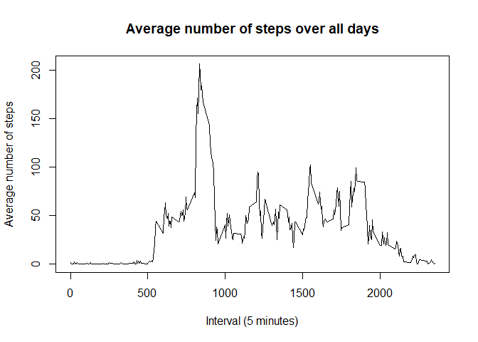
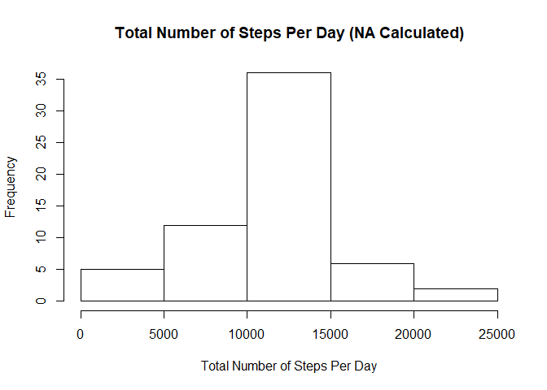
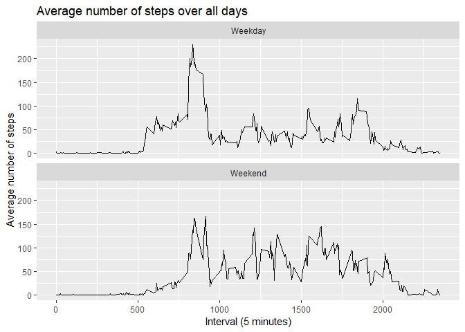

This is an R Markdown document containing all the required steps to reproduce the analysis required for completing week 2 of the Reproducible Research module.

### The steps include the following:

1. Code for reading in the dataset and/or processing the data
2. Histogram of the total number of steps taken each day
3. Mean and median number of steps taken each day
4. Time series plot of the average number of steps taken
5. The 5-minute interval that, on average, contains the maximum number of steps
6. Code to describe and show a strategy for imputing missing data
7. Histogram of the total number of steps taken each day after missing values are imputed
8. Panel plot comparing the average number of steps taken per 5-minute interval across weekdays and weekends
9. All of the R code needed to reproduce the results (numbers, plots, etc.) in the report.

### Loading and preprocessing the data

Show any code that is needed to

1. Load the data (i.e. read.csv()\color{red}{\verb|read.csv()|} read.csv())
2. Process/transform the data (if necessary) into a format suitable for your analysis

Sets the working directory and the data.


```r
library(plyr)
```

```
## Warning: package 'plyr' was built under R version 3.5.1
```

```r
library(ggplot2)
```

```
## Warning: package 'ggplot2' was built under R version 3.5.1
```

```r
setwd("D:/SVN - BIDs/branches/sandpit/flintan/Data Science Coursera/MarkDown")
activity_data <- read.csv("activity.csv")
activity_data_tidy <- subset(activity_data, !is.na(steps))
activity_data_tidy$date <- as.Date(activity_data_tidy$date, "%Y-%m-%d")
```

### What is mean total number of steps taken per day?

For this part of the assignment, you can ignore the missing values in the dataset.

1. Calculate the total number of steps taken per day
2. If you do not understand the difference between a histogram and a barplot, research the difference between them. Make a histogram of the total number of steps taken each day
3. Calculate and report the mean and median of the total number of steps taken per day


```r
# Calculate the total number of steps taken per day
steps_day <- ddply(activity_data_tidy, .(date), summarise, total_steps = sum(steps))

hist(steps_day$total_steps, main = "Total Number of Steps Per Day",
    xlab = "Total Number of Steps Per Day", ylab = "Frequency")
```

<!-- -->

```r
# The mean of total number of steps taken per day is:
mean(steps_day$total_steps, na.rm = T)
```

```
## [1] 10766.19
```

```r
# The median of total number of steps taken per day is:
median(steps_day$total_steps, na.rm = T)
```

```
## [1] 10765
```


### What is the average daily activity pattern?

1. Make a time series plot (i.e. type = "l"\color{red}{\verb|type = "l"|} type="l") of the 5-minute interval (x-axis) and the average number of steps taken, averaged across all days (y-axis)
2. Which 5-minute interval, on average across all the days in the dataset, contains the maximum number of steps?


```r
# preprocessing data for plot
steps_by_interval <- aggregate(steps ~ interval, activity_data_tidy, mean)

# create a time series plot 
plot(steps_by_interval$interval, steps_by_interval$steps, type = 'l',
     main = "Average number of steps over all days",
     xlab = "Interval (5 minutes)",
     ylab = "Average number of steps")
```

<!-- -->

Which 5-minute interval, on average across all the days in the dataset, contains the maximum number of steps?

```r
steps_by_interval[which.max(steps_by_interval$steps),]
```

```
##     interval    steps
## 104      835 206.1698
```

### Imputing missing values
Note that there are a number of days/intervals where there are missing values (coded as NA\color{red}{\verb|NA|} NA). The presence of missing days may introduce bias into some calculations or summaries of the data.

1. Calculate and report the total number of missing values in the dataset (i.e. the total number of rows with 
NA\color{red}{\verb|NA|} NAs)
2. Devise a strategy for filling in all of the missing values in the dataset. The strategy does not need to be sophisticated. For example, you could use the mean/median for that day, or the mean for that 5-minute interval, etc.
3. Create a new dataset that is equal to the original dataset but with the missing data filled in.
4. Make a histogram of the total number of steps taken each day and Calculate and report the mean and median total number of steps taken per day. Do these values differ from the estimates from the first part of the assignment? What is the impact of imputing missing data on the estimates of the total daily number of steps?


```r
# Total number of missing values
sum(is.na(activity_data))
```

```
## [1] 2304
```

```r
mean_intervals <- ddply(activity_data_tidy, .(interval), summarise, mean_steps = mean(steps))
new_activity_data <- activity_data
for (i in 1:nrow(new_activity_data)) {
    if (is.na(new_activity_data$steps[i])) {
        interval_value <- new_activity_data$interval[i]
        new_steps_value <- mean_intervals[mean_intervals$interval == interval_value,]
        new_activity_data$steps[i] <- new_steps_value$mean_steps
    }
}
sum(is.na(new_activity_data))
```

```
## [1] 0
```

```r
steps_day_noNA <- ddply(new_activity_data, .(date), summarise, total_steps = sum(steps))

hist(steps_day_noNA$total_steps, main = "Total Number of Steps Per Day (NA Calculated)",
    xlab = "Total Number of Steps Per Day", ylab = "Frequency")
```

<!-- -->

```r
# The mean of total number of steps taken per day is:
mean(steps_day_noNA$total_steps, na.rm = T)
```

```
## [1] 10766.19
```

```r
# The median of total number of steps taken per day is:
median(steps_day_noNA$total_steps, na.rm = T)
```

```
## [1] 10766.19
```


### Are there differences in activity patterns between weekdays and weekends?

For this part the weekdays()\color{red}{\verb|weekdays()|} weekdays() function may be of some help here. Use the dataset with the filled-in missing values for this part.

1. Create a new factor variable in the dataset with two levels - "weekday" and "weekend" indicating whether a given date is a weekday or weekend day.
2. Make a panel plot containing a time series plot (i.e. type = "l"\color{red}{\verb|type = "l"|} type="l") of the 5-minute interval (x-axis) and the average number of steps taken, averaged across all weekday days or weekend days (y-axis). See the README file in the GitHub repository to see an example of what this plot should look like using simulated data.


```r
steps_by_interval_noNA <- new_activity_data
steps_by_interval_noNA$day <- as.factor(weekdays(as.Date(steps_by_interval_noNA$date)))
steps_by_interval_noNA$weekend <- as.factor(ifelse(grepl(pattern = "Saturday|Sunday", steps_by_interval_noNA$day, ignore.case = TRUE), c("Weekend"), c("Weekday")))

steps_by_interval_noNA <- aggregate(steps ~ interval + weekend, steps_by_interval_noNA, mean)

qplot(interval,
      steps,
      data = steps_by_interval_noNA,
      geom = c("line"),
       main = "Average number of steps over all days",
       xlab = "Interval (5 minutes)",
       ylab = "Average number of steps") +
       facet_wrap(.~weekend, ncol = 1)
```

<!-- -->
